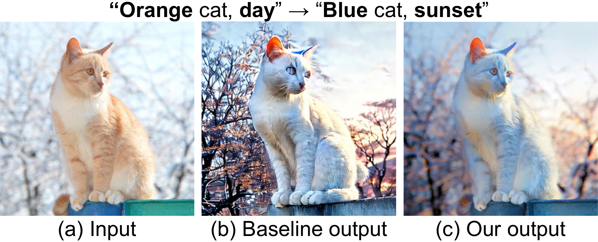
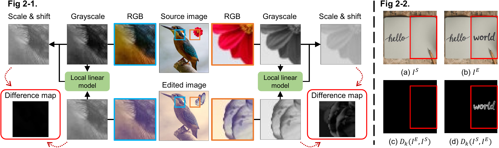
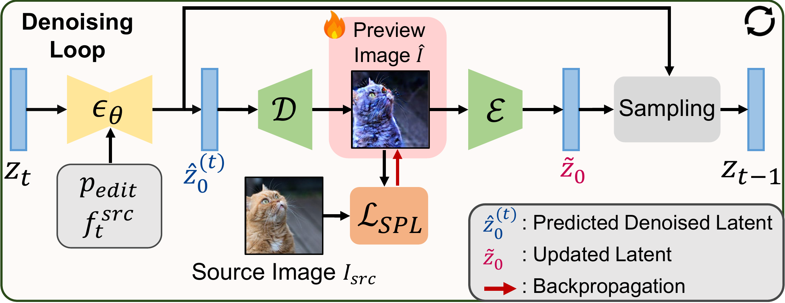

# SPL: Structure Preservation Loss for Pixel-Level Edge-Aware Image Editing

Official implementation of **"Edge-Aware Image Manipulation via Diffusion Models with a Novel Structure-Preservation Loss"**

[](https://arxiv.org/abs/2601.16645)
[](https://gongms00.github.io/SPL-project-page/)
[](LICENSE.txt)



## Overview

SPL is a training-free method for pixel-level structure-preserving image editing using latent diffusion models. Unlike existing methods that only preserve coarse layouts, SPL maintains fine-grained edge structures while allowing creative semantic edits through text prompts.

**Key Features:**
- **Pixel-Level Structure Preservation**: Local Linear Model-based loss for maintaining edge details
- **Training-Free**: Plug-and-play with pre-trained diffusion models
- **Versatile Editing**: Supports relighting, tone adjustment, style transfer, season changes, background replacement, and more
- **Precise Local Control**: Cross-attention mask upsampling for targeted editing
- **Interactive Interface**: Easy-to-use Gradio web demo

## Installation

### Setup

1. Clone the repository:
```bash
git clone https://github.com/gongms00/SPL.git
cd SPL
```

2. Create a conda environment:
```bash
conda create -n spl python=3.10 -y
conda activate spl
```

3. Install PyTorch:
```bash
pip install torch==2.8.0 torchvision==0.23.0 torchaudio==2.8.0 --index-url https://download.pytorch.org/whl/cu128
```

4. Install remaining dependencies:
```bash
pip install -r requirements.txt
```

5. (Optional) Set environment variables for harmonization feature:
```bash
export OPENAI_API_KEY=your_openai_key
```

## Quick Start

### Running the Interactive Demo

```bash
python app.py
```

Open your browser at `http://localhost:7860`

### Basic Usage

1. Upload a source image
2. Enter source prompt (describing the current image)
3. Enter edit prompt (describing the desired edit)
4. Adjust parameters if needed
5. Click "Run" to generate the edited image

## Method Overview

### Structure Preservation Loss (SPL)

SPL quantifies structural differences between source and edited images using Local Linear Models. For each local window, the loss enforces that the edited image is a linear transformation of the source. The bidirectional constraint ensures robust structure matching, even in flat regions.



**Key Properties:**
- Edge-preserving: image gradients are preserved through the local linear model
- Computed on grayscale (intensity) channel for uniform RGB updates
- Color Preservation Loss (CPL) handles chrominance preservation

### Integration with Diffusion Models

At each denoising timestep, the predicted latent is decoded to image space, optimized with SPL using the source image as reference, then re-encoded back to latent space. A final post-processing step refines the decoded output to recover fine details lost during VAE decoding.



### Cross-Attention Mask Upsampling

For localized editing:
1. Extract 16x16 attention map from cross-attention layers
2. Progressively upsample 2x with guided filter at each step
3. Source image guides edge-aligned boundary refinement
4. Result: high-resolution mask with sharp, accurate boundaries

## Key Parameters

### Structure & Color Preservation

These are the core parameters that control how much the edited image preserves the source image's structure and color.

| Parameter | Default | Description |
|-----------|---------|-------------|
| Attention control schedule | 0.8 | Controls coarse structure preservation via cross/self-attention replacement. Higher values enforce stronger consistency with the source image, but the edit may be applied less strongly. |
| Optimization schedule | 0.8 | Fraction of denoising steps after which SPL/CPL optimization begins. Recommended to match the attention control schedule. |
| Preserve structure (SPL) | On | Enables the Structure Preservation Loss to maintain edge structures during editing. |
| Preserve color (CPL) | Off | Enables the Color Preservation Loss to prevent unintended color shifts. |
| Structure loss weight | 10000 | Weight for SPL. Higher values enforce stronger structure preservation. |
| Color loss weight | 1000 | Weight for CPL. Try values in the range 100~10000. |
| Optimization iterations | 100 | Number of gradient descent steps per denoising timestep for SPL/CPL optimization. |
| Post-processing with loss | On | Applies an additional refinement step on the final decoded image using SPL/CPL to recover fine details lost during VAE decoding. |

### Mask Settings

When SPL or CPL is set to "Masked area" mode, these parameters control which regions of the image are preserved. Masks are extracted from cross-attention maps and upsampled using guided filtering.

| Parameter | Default | Description |
|-----------|---------|-------------|
| Preservation area | Whole image | Whether to apply the loss to the whole image or only the masked area. |
| Mask words (source/target) | - | Comma-separated words from the prompt whose attention maps define the mask region. |
| Threshold | 0.5 | Binarization threshold for the attention-based mask. Higher values produce smaller, more focused masks. |
| Invert mask | Off | Inverts the mask so that the loss is applied to the area outside the selected words. |

### General Settings

| Parameter | Default | Description |
|-----------|---------|-------------|
| Source/Target prompt | - | Source prompt describes the input image; target prompt describes the desired edit. |
| Inference steps | 15 | Number of denoising steps. |
| Source guidance scale | 1 | Classifier-free guidance scale for the source prompt. |
| Target guidance scale | 2 | Classifier-free guidance scale for the target prompt. Increase for stronger editing. |
| Seed | 0 | Random seed for reproducibility. |

## Related Work

This project builds upon:
- **[InfEdit](https://github.com/sled-group/InfEdit)** (Xu et al., 2024): Coarse-structure-preserving editing via attention conditioning
- **[Prompt-to-Prompt](https://github.com/google/prompt-to-prompt)** (Hertz et al., 2023): Cross-attention control for text-driven editing

Our contribution is the Structure Preservation Loss (SPL) that adds pixel-level edge structure preservation to these coarse-structure methods.

## Citation

```bibtex
@inproceedings{gong2026spl,
  title={Edge-Aware Image Manipulation via Diffusion Models with a Novel Structure-Preservation Loss},
  author={Gong, Minsu and Ryu, Nuri and Ok, Jungseul and Cho, Sunghyun},
  booktitle={Proceedings of the Winter Conference on Applications of Computer Vision (WACV)},
  year={2026}
}
```

## Acknowledgements

- [InfEdit](https://github.com/sled-group/InfEdit) for the base editing framework
- [Prompt-to-Prompt](https://github.com/google/prompt-to-prompt) for attention control
- [LCM](https://huggingface.co/SimianLuo/LCM_Dreamshaper_v7) for efficient sampling
- [Guided Filter](https://people.csail.mit.edu/kaiming/publications/eccv10guidedfilter.pdf) for edge-aware processing

## License

This project is licensed under the Apache License 2.0. See [LICENSE.txt](LICENSE.txt) for details.
